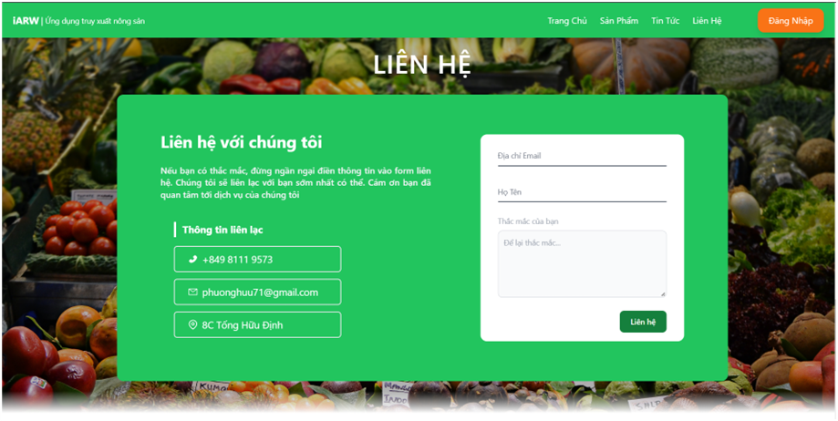

# Application for tracing agricultural product

## Why I choose this topic?

- Currently, there are many foods of unknown origin on the market, and it is difficult for consumers to avoid the dangers that this situation causes. In fact, many people face threats from the very foods they consume every day. Many foods seem fresh and delicious, but few people know the truth about their origin. Although QR Code technology has only been widely applied in the past few years, it has proven to be a major breakthrough in replacing traditional barcodes. That's thanks to the ability to store hundreds of times more information in many different character formats.
- The advantage is that users can freely scan QR Code from anywhere, at any distance and location. With the ability to recover from 30 to 35% of data in case of contamination or damage, QR Code technology helps completely overcome the limitations of traditional barcodes. Absolute information security is also one of the reasons why payment via QR Code is becoming increasingly popular. Accordingly, when choosing this form of payment, customers do not need to enter personal information such as account numbers, card numbers... which are considered information that is easily stolen.
- Using product origin traceability technology and QR Code technology will easily handle poor quality or counterfeit shipments and help control goods brought into the market transparently and clearly. , thereby limiting the amount of poor quality and counterfeit goods circulating in the market.

## Technologies I use

### The main packages for Front-End

- redux-toolkit/react-redux: For managing global state.
- axios: Making HTTP Request from the browser.
- react-router-dom: For routing & navigating.
- sass: For stying, managing classes.
- tailwindcss: Providing utility classes.
- react-qr-code: Generating QR code.
- react-table/react-paginate: For table management, pagination supports.
- socket.io-client: For realtime chat function on client side.
- react-google-login: For login with google function.

### Back-End packages

- express: Provides broad features for building web and mobile applications.
- socket.io: For realtime chat function on server side.
- mongoose: An Object Data Modeling (ODM) library for MongoDB and Node.js.
- jsonwebtoken: Generating token for login.
- nodemon: restarting the node application when file changes**.**
- bcryptjs: Enables storing passwords as hashed passwords instead of plaintext**.**

## Main functions

### Contact Form

- Allow user to send request directly to webpage owner email.
- The information of email, name, message will be sent.

### Login Form

- Allow user to use google account to login and use all “user” function.

### Dashboard interface

- The main interface of application.
- The user can sort by popularity, latest.
- Filter by the agricultural types, by location.
- It also provides search function and pagination.

### Product management

- Where you store all of your products.
- It contains search by field, go to page, pagination, show visible number by rows.
- And fully functional with CRUD.

### Create Product

- You can provide name, description, type, quantity, unit, origin and cover image.
- All informations are compulsory.

### Edit Product

- Just as same as create product, in here you can load and edit your created product.

### 5 Steps Process

- Every product will have 5 steps from planting to exporting product.
- The interface is very similar to Product management.

### Creating Process

- A procress will have its own step, name and note.

### Edit process

- This will allow you to edit your created process.

### Delete process

- A popup will show up to ask you if you want to delete this process.

### Approval process

- This is the interface only available for “admin”.
- It will allow them to approve products, the default status after the “user” creates a new product is “Pending”.
- If the user fill all the informations needed, they can approve it, the status will be “Approved”.
- If not and the status is “Declined”, the “user” can edit the product again and it’ll be sent back to the “admin” will the status “Pending”

### Review product

- The “admin” can preview of what being sent by user by clicking review button.

### Product detail

- Allow you to watch all informations of the product.
- It also provides 5 steps process so you can track on your product.

### Chat function

- Allow users to chat with each other & with admin to report errors happen during managing process.

## Conclusion

- That’s pretty much it, hope you can find it useful, the detail description is in the docs file.
- It’s written in vietnamese so if you’re not familiar with it, you can translate it to English.
